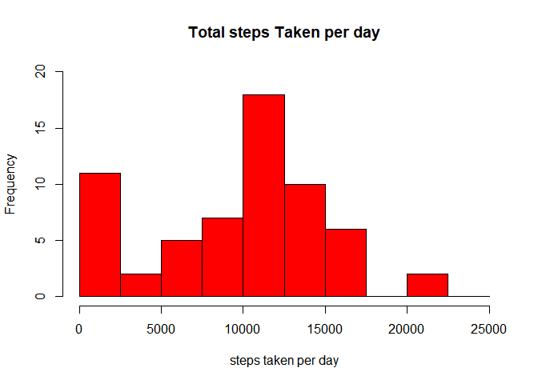

===========================================

# step1


# Loading data


```r
data<-read.csv("activity.csv")
str(data)
```

```
## 'data.frame':	17568 obs. of  3 variables:
##  $ steps   : int  NA NA NA NA NA NA NA NA NA NA ...
##  $ date    : Factor w/ 61 levels "2012-10-01","2012-10-02",..: 1 1 1 1 1 1 1 1 1 1 ...
##  $ interval: int  0 5 10 15 20 25 30 35 40 45 ...
```

# step2


## What is mean total number of steps taken per day?


```r
stepsperday<-tapply(data$steps,data$date,sum,na.rm=TRUE)
 hist(stepsperday,col="red",ylim = c(0,20), breaks = seq(0,25000, by=2500),main="Total steps Taken per day",xlab="steps taken per day")
```

<!-- -->
 
 **Mean of total steps**
 
 

```r
 mean(stepsperday)
```

```
## [1] 9354.23
```
 
 
  **Median of Total steps**
 
 

```r
 median(stepsperday)
```

```
## [1] 10395
```
 
 
 
# step3
 
 
## Average daily pattern 


```r
avgdaily_activity<-aggregate(data$steps ,by=list(data$interval),mean,na.rm=TRUE)
 names(avgdaily_activity)<-c("interval","mean")
 plot(avgdaily_activity$interval,avgdaily_activity$mean,xlab="average number of steps ",ylab="Interval",main="Average Daily Pattern",type="l")
```

<!-- -->


**Interval having Maximum number of steps**


```r
avgdaily_activity[which.max(avgdaily_activity$mean),]$interval
```

```
## [1] 835
```


# step4

## Imputing missing values


**total number of missing values in the dataset**


```r
 sum(is.na(data))
```

```
## [1] 2304
```


**Devising a strategy - taking mean for that day**


```r
imputed_steps <-  avgdaily_activity$mean[match(data$interval,  avgdaily_activity$interval)]
```


**Creating a new dataframe with imputed steps**


```r
imputed_data <- transform(data, steps = ifelse(is.na(data$steps), yes = imputed_steps, no = data$steps))
imputedstepsperday<-tapply(imputed_data$steps,imputed_data$date,sum,na.rm=TRUE)
hist(imputedstepsperday,col="red",ylim = c(0,20), breaks = seq(0,25000, by=2500),main="Total steps Taken per day",xlab="imputed steps taken per day")
```

<!-- -->


**Mean of total steps**
 
 

```r
 mean(imputedstepsperday)
```

```
## [1] 10766.19
```
 
 

 **Median of Total steps**
 
 

```r
 median(imputedstepsperday)
```

```
## [1] 10766.19
```


# step5


## differences in activity patterns between weekdays and weekends


**Create a new factor variable in the dataset with two levels – “weekday” and “weekend” indicating whether a given date is a weekday or weekend day.**


```r
imputed_data$date <- as.Date(strptime(imputed_data$date, format="%Y-%m-%d"))
imputed_data$day <- weekdays(imputed_data$date)
for (i in 1:nrow(data)) {
    if (imputed_data[i,]$day %in% c("Saturday","Sunday")) {
        imputed_data[i,]$day<-"weekend"
    }
    else{
        imputed_data[i,]$day<-"weekday"
    }
}
stepsByDay <- aggregate(imputed_data$steps ~ imputed_data$interval + imputed_data$day, imputed_data, mean)
```


**Make a panel plot containing a time series plot **


```r
names(stepsByDay) <- c("interval", "day", "steps")
library(lattice)
xyplot(steps ~ interval | day, stepsByDay, type = "l", layout = c(1, 2), 
    xlab = "Interval", ylab = "Number of steps")
```

<!-- -->


